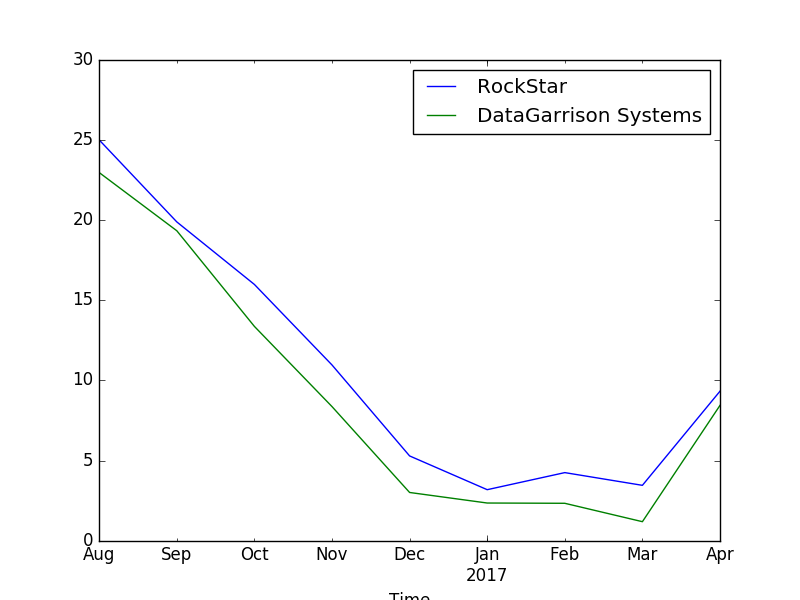
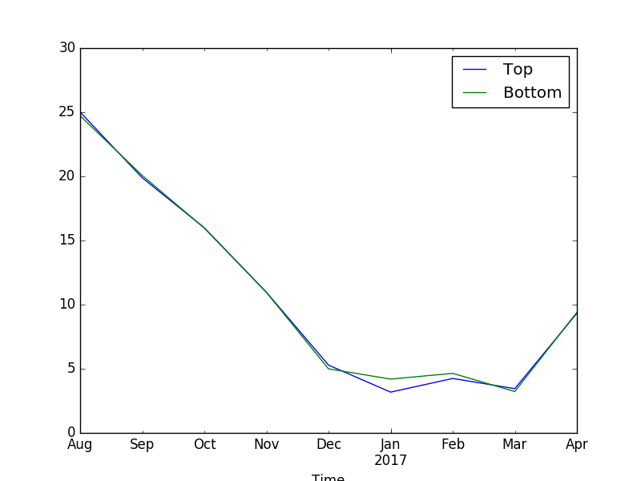

# Sensor_package on mini_boat

RaspberryPi read the temperature sensor data and send the data to satellite transmatter.We may get three defferent type of data: One is '000000000000000000', which means both sensors is down; Two is '000000000' shows in the start or end of the message; Three is normal data we need.

We put the sensor package on one mini_boat named RockStar.Jim and I did a lot work to finish it. We left RockStar at the Jim's house backyard since August, 2016. I compared RockStar data with DataCarrison System--Temperature sensor at Waquoit Bay,Falmouth.

There are two temperature sensor on RockStar. One is on the top of pole. Another one is at the bottom of tail. Comparison of two sensors.
